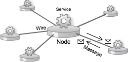
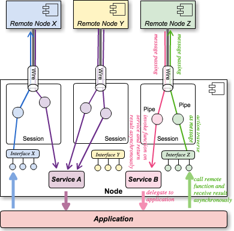
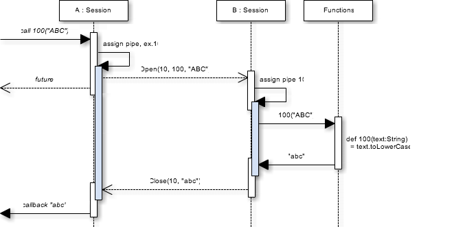
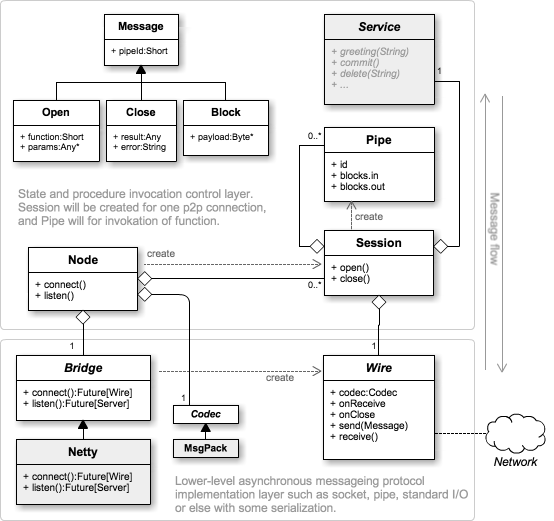

## Developer Guide

**STATUS:** 書きかけ

### イントロダクション

asterisque は非同期 I/O の煩雑さをうまくラップしインターフェースの共有による手軽で型安全な非同期 RPC、メッセージパッシング、データストリーミングを共存実装できるように設計を行っています。

asterisque を使用した現実的なアプリケーション実装においては `Future` や `ExecutionContext` などの理解が必要となります。実装者は Scala での非同期処理や並行処理に関する基本な知識を持っている事を前提としています。

### 構成の概要

最初に asterisque の基本的な構成と各コンポーネントの役割について説明します。

#### ネットワークの構成

asterisque は多数の **ノード** (Node) を **ワイヤー** (Wire) で接続することで P2P 型の仮想ネットワークを形成します。ワイヤーは 2 つのノードをデータ欠損のない順序の保証された方法で永続的に接続し、非同期かつ双方向に **メッセージ** (Message) を伝達するネットワーク実装です。具体的には TLS over TCP や AMQP、プロセス間通信、あるいは同一プロセス内でのスレッド間通信などでの実装を想定しています。

TCP/IP を使用するワイヤー上の通信は TLS によって暗号化されます。ネットワークを構成するノードの多くはヒューマンインタラクティブな状態ではなく、ノードはクライアント認証を使用して自分が何者であるかを証明します。



#### 機能の公開と利用

アプリケーションは任意の **サービス** (Service) を実装してノード上で公開することができます。サービスとはノードに接続しているピアが呼び出す事の出来る **ファンクション** (Function) の集合です。ファンクションは asterisque におけるリモート呼び出し可能な処理のエントリポイントを表します。ファンクションは同一サービス内で 2 バイト整数で識別されます。このため同時に公開できるのは最大65,536個までです。

例として何らかの CRUD 操作をおこなうサービスのインターフェースを定義します (実装の詳細は [サービスの実装と呼び出し](#ServiceImplementationAndRemoteCall) を参照)。

```scala
trait CRUDService {
  @Export(10) def create(key:String, value:String):Future[Unit]
  @Export(20) def read(key:String):Future[String]
  @Export(30) def update(key:String, value:String):Future[Unit]
  @Export(40) def delete(key:String):Future[Unit]
}
```

セキュリティ的な理由から接続中のピアがどのようなサービスを公開しているかを知る標準的な方法を定義していません。これにはアプリケーションがサービス不明のピアに接続することはないという暗黙的な前提をおいています。アプリケーションはどのファンクションをどの番号でピアに公開するか、あるいはしないかを若干の低レベルな操作だけで実行時に決定することが出来ます。つまりピアによって更新系処理を公開しない選択をしたり、ピアごとにファンクション番号を変更することでサービススキャンのような攻撃を難しくする実装も可能です。もし本当にシステム設計がピアのファンクション一覧を必要とするなら、例えばシステム上のすべてのサービスにおいてファンクション 0 はサービス識別子を参照するファンクションといった実装を行うことが出来ます。

ファンクションは一般的な言語の関数/メソッドと同様に任意数のパラメータを指定して開始し単一の結果 (正常な処理結果または例外のどちらか) を戻すことが出来ます。ファンクションは非同期かつ並列処理での実装を前提としており、呼び出しは直ちに `Future` を返して終了する必要があります。処理に時間がかかる場合は別スレッドで処理を行い、処理の終了とその結果を`Future` 経由で通知することで呼び出しのノードが結果を受け取ります。

#### 接続と呼び出し状態の管理

ノード上で新しいワイヤー (接続) が発生すると **セッション** (Session) が生成されます。セッションはワイヤーと 1:1 の関係でスコープもほぼ等価ですが、Socket などの低レベルな通信状態の管理をファンクションの呼び出し状態の管理から分離することで、通信実装の差し替えが出来るように構成しています。

セッションはピアに公開するサービスを 1 つ持ちます。アプリケーションはピアとのセッションの途中で他のセッションに影響を与えずピアに対するサービスを変更することが出来ます。

ピアのファンクションを呼び出した時、あるいはピアからファンクションが呼び出された時、双方のセッション上に **パイプ** (Pipe) と呼ばれる呼び出しの状態が発生します。パイプはファンクション実行中に送受信するメッセージの宛先を表し、呼び出し開始から処理の終了までのスコープを持ちます。

アプリケーションはこのパイプを使用して *メッセージング* を行うことが出来ます。メッセージングは双方のパイプに対する **ブロック** の送受信です。アプリケーションはこのメッセージング機構を利用して双方向の非同期メッセージパッシングやストリーミングを行うことが出来ます。



一般的な RPC で提供されるような短時間で終了するファンクション呼び出しで発生するパイプは短命です。しかしメッセージングを伴うパイプはそれが終了するまで維持されるため長期的に存在します。セッションが終了するとそのセッション上のパイプもすべて消滅します。

パイプは同一セッション内で 2 バイト整数によって識別されます。新しいパイプを生成する (相手のファンクションを呼び出す) 時に相手の合意なしにユニークなパイプ ID を決定できるよう、ID の最上位ビット 1 または 0 をどちらが使用するかを接続時に決定します。このためある時点で片方のノードから同時に実行できる呼び出しは最大で 32,768 個、双方で 65,535 個となります。

#### メッセージの種類

asterisque が目指したゴールはメッセージングが可能な双方向の非同期 RPC です。単純な RPC 型プロトコルであれば HTTP のようなリクエスト-レスポンス型のメッセージで十分ですが、メッセージングとしてのモデルを考えた場合:

1. メッセージングの開始。ピアの双方でメッセージングのためのパイプを開く。
1. そのパイプを通して双方のプロセスがメッセージを送受信する。
1. メッセージングが終了すれば結果付きでパイプを閉じる。

とすることで概念的にもすっきりします。メッセージングを行わずオープン-クローズのみで完結する通信は先述の "単純な RPC 型プロトコル" と同じリクエスト-レスポンス型と同じスキームですので、上位互換の設計として RPC とメッセージングをうまく統合することが出来ます。

このような経緯で asterisque では以下の 3 種類のメッセージを導入しています。

1. **Open** … パイプID，ファンクション番号、パラメータを指定して該当ファンクションに対するパイプをオープンする。
1. **Close** … パイプIDを指定して該当するパイプを閉じる。正常な処理結果かエラーメッセージのどちらかを伴う。
1. **Block** … パイプIDを指定して任意のバイナリデータを転送する。

Open は常に呼び出し側 caller から送信されますが、Close 及び Block は caller, callee のどちらからでも送信が可能です。



#### 通信レイヤーの実装

ワイヤーは様々な実装が可能です。TCP/IP ソケットのような典型的な listen, connect 操作でワイヤーを生成する場合はワイヤーのファクトリとして **ブリッジ** ([Bridge](https://github.com/torao/asterisk/blob/master/src/main/scala/com/kazzla/asterisk/Bridge.scala)) として実装することができます。標準では Netty を使用したブリッジが提供されています (Java 標準の SSLSocket は非同期 I/O に対応しておらず SocketChannel を使用して独自の SSL 実装を追加する必要があったため Netty を使用しました)。

```scala
trait Bridge {
  def connect(codec:Codec, address:SocketAddress, sslContext:Option[SSLContext]):Future[Wire]
  def listen(codec:Codec, address:SocketAddress, sslContext:Option[SSLContext])(onAccept:(Wire)=>Unit):Future[Server]
}
class Server(val address:SocketAddress) extends Closeable { def close():Unit = None }
```

ブリッジは `connect()` で指定したアドレスのノードに接続し `Wire` の Future を返します。同様に `listen()` は指定されたアドレスにバインドしピアからの接続を受け付けると `onAccept` を呼び出します。それぞれが生成するワイヤーでは指定された **コーデック** (Codec) を使用してメッセージのシリアライズが行われます。ブリッジのインスタンスは Singleton で使用されるためスレッドセーフに実装する必要があります。

このようなネットワークを前提とした設計のブリッジでなく、アプリケーションが定義するメッセージの伝達経路を独自のワイヤーとして実装することができます。その一つの実装としてネットワークを使用せず二つのノードインスタンス間で直接メッセージを伝達するワイヤーのペアを標準で使用することが出来ます。

```scala
val (wire1, wire2) = Wire.newPipe()
val session1 = node1.bind(wire1)
val session2 = node2.bind(wire2)
```

上記の例はパイプ化されたワイヤーペアを使用して二つのノードをオンメモリで接続しています。

#### アプリケーションの実装

アプリケーションは各ノードでどのようなサービスを公開するかを決めインターフェースを定義します。
ワイヤーが接続されたときにどちらがどういったアクションを取るかプロトコルを決めます。
クライアント証明書の発行や管理手順を決めます。

アプリケーションが実装で意識しなければならないこと

1. ノードが公開するサービスのインターフェース定義とその実装。
1. メッセージングを行う場合、ファンクション呼び出し中のブロック送受信、または入出力ストリームの使用。
1. ノードを使用した接続または接続の受け付けを実装。

#### コンポーネントの構成

以下に asterisque で使用する主要なクラスの構成を挙げます。アプリケーションが実装しなければならないものは `Service` のサブクラスであり、理解しなければならないものは `Session` と `Service` です。



### <a name="ServiceImplementationAndRemoteCall"></a>サービスの実装と呼び出し

#### インターフェースによるサービス実装と呼び出し

* [サンプルコード](https://github.com/torao/asterisk/blob/master/src/test/scala/sample/Sample1.scala)

asterisque での RPC はクライアント/サーバで共有される `trait` (インターフェース) に基づいて実装することが出来ます。この方法は後述する DSL による実装より厳密で静的型付き言語と親和性が良いため例の多くはこちらの方法を使用します。

インターフェースによるサービス実装の例として `greeting()` というリモート呼び出し可能なメソッドを一つだけ持つ trait を考えます。

```scala
trait GreetingService {
  @Export(10)
  def greeting(name:String):Future[String]
}
```

`@Export(10)` はこのメソッドがリモート呼び出し可能であり、そのファンクション番号として 10 を割り当てられている事を示しています。ファンクション番号は公開中のサービスで機能を識別するための short 値です。同一の trait 内でユニークな番号を割り当てる必要があります。

もう一つの重要な要件として `@Export` によって公開されたメソッドは `scala.concurrent.Future` の返値を宣言する必要があります。

ファンクションの実装側ではファンクションの実行スレッドははノードで共有されており、ファンクション内で時間のかかる処理を行うとそのノードのすべての呼び出しが影響を受けます。このため I/O ウェイトなどの時間のかかる処理を行う場合は `scala.concurrent.future` などを使用して非同期化しすぐに終了する必要があります。

また asterisque は非同期メッセージングに基づいて実装されているためクライアント側でも `Future` で非同期に結果を受け取る事が出来ます (`Future` は `Await` を使用することで同期化を選択的に使用できます)。

上記の trait は `Service` クラスと併せて以下のように実装できます。

```scala
class GreetingServiceImpl extends Service with GreetingService {
  def greeting(name:String):Future[String] = Future(s"hello, $name")
}
```

もし時間のかかる処理を行うのであれば並行処理を使用して以下のように実装できます。

```scala
def greeting(name:String):Future[String] = scala.concurrent.future {
  Thread.sleep(3 * 1000)  // 時間のかかる処理…
  s"hello, $name"
}
```

サーバ側ノード作成時にこのサービスを指定し、クライアント側ノードからセッション確立後に呼び出します。このとき `Session.bind()` を用いてリモートインターフェースに対するスケルトン (動的プロキシ) を取得することでシームレスな呼び出しが可能です。

```scala
val server = Node("server").serve(new GreetingServiceImpl()).build()
server.listen(new InetSocketAddress("localhost", 5330), None)

val client = Node("client").build()
client.connect(new InetSocketAddress("localhost", 5330), None).onComplete{
  case Success(session) =>
    val service = session.bind(classOf[GreetingService])
    service.greeting("asterisque").andThen {
      case Success(result) => System.out.println(result)
      case Failure(ex) => ex.printStackTrace()
    }.onComplete { _ =>
      server.shutdown()
      client.shutdown()
    }
  case Failure(ex) => ex.printStackTrace()
}
```

上記は `Await` を使用することでクライアント側を同期実装することができます。

```scala
val future1 = client.connect(new InetSocketAddress("localhost", 5330), None)
val session = Await.result(future1, Duration.Inf)
val service = session.bind(classOf[GreetingService])
val future2 = service.greeting("asterisque")
val result = Await.result(future2, Duration.Inf)
System.out.println(result)
server.shutdown()
client.shutdown()
```

#### ファンクション番号によるサービス実装と呼び出し

* [サンプルコード](https://github.com/torao/asterisk/blob/master/src/test/scala/sample/Sample2.scala)

インターフェースを使用する代わりにファンクション番号とその実装を直接結合してサービスを実装することが出来ます。

```scala
class GreetingServiceImpl extends Service {
  10 accept { args => Future(s"hello, ${args(0)}") }
}
```

クライアント側でもセッションにファンクション番号を指定してリモートメソッドを呼び出すことが出来ます。`open()` 返値の Future を参照し呼び出し結果を非同期で参照することが出来ます。

```scala
val future = session.open(10, "asterisque")
future.onComplete{
  case Success(result) => System.out.println(result)
  case Failure(ex) => ex.printStackTrace()
}
```

#### 非同期メッセージングの実装

* [サンプルコード](https://github.com/torao/asterisk/blob/master/src/test/scala/sample/Sample3.scala)
* [サンプルコード](https://github.com/torao/asterisk/blob/master/src/test/scala/sample/Sample5.scala)

非同期メッセージングの実装は RPC と若干設計の見方が変わります。クライアントとサービスで明確な役割の違いがある RPC と違い、非同期メッセージングではピアの両方で `(Pipe)=>Future[Any]` 型の処理を実装してパイプを経由したメッセージの送受信を行います。

例としてメッセージの双方向かつ対等実装の例としてピアに文字列のメッセージを送信し、受信したメッセージを出力する処理を挙げます。

```scala
def ping(sec:Int)(pipe:Pipe):Future[Any] = {
  // set function on receive messages
  pipe.src.foreach{ b => println(b.getString) }
  // return Future[Int] immediately, and send ping counter asynchronously
  scala.concurrent.future {
    (0 to sec).foreach{ s =>
      pipe.sink.send(s.toString.getBytes)
      Thread.sleep(1000)
    }
    sec
  }
}
```

クライアント側もサービス側もこの実装はメッセージの配信スレッドによって実行されるため `Future` を返して直ちに終了する必要があります。処理の完了はピアのどちらかが返値の `Future` に結果の値または例外を設定することで相手に伝播し双方のパイプがクローズされます。

この処理はクライアントとサービスの双方で実装として使用することが出来ます (もちろんクライアントとサービスとで異なる実装を指定することも出来ます)。

```scala
class PingService extends Service {
  @Export(100)
  def p(sec:Int) = withPipe(ping(sec))
}

val future = session.open(100, 10)(ping(10))
System.out.println(Await.result(future, Duration.Inf))  // 10
```

上記の処理は少し行儀が悪く、先に 10 をカウントした方が `Future` に結果を設定し双方の処理は終了します。従って遅い方は送信エラーを起こすかも知れません。よりスマートな実装では処理のどちらが結果を出すかを決定した方が良いでしょう。相手が結果を設定することが分かっている場合、処理は `pipe.future` を返します。

##### メッセージの送信

パイプの両端でやり取りされるメッセージは単純なバイト配列で表されます。サービス実装側では `withPipe` を用いて呼び出しが行われているパイプを参照することが出来ます。このパイプはクローズされていない限りどのようなスレッドからでも `send()` メソッドを実行してメッセージを送信することが出来ます。

```scala
@Export(10)
def someService():Future[Unit] = withPipe { p1 =>
  p1.sink.send(...)
  scala.concurrent.future{
    // NG: 別スレッドからはパイプを参照できない (ラムダは実行されず failed の Future が返る)
    withPipe { p2 => p2.sink.send(...) }
    p1.sink.send(...)
    "bingo!"  // この非同期処理の結果を結果とする
  }
}
```

クライアント実装では RPC のようなインターフェースバインディングを使用した方法でパイプを取得する手段がないためファンクション番号を指定してパイプを生成します。`session.open(...)` のラムダ内で参照できるパイプに対してブロックの送信が可能です。

```scala
// oepn() で返ってきたパイプは送信が可能な状態
session.open(10){ pipe =>
  pipe.sink.send(...)
  pipe.future   // 相手の処理結果を結果とする
}
```

サービス側の実装と同様に `session.open()` で指定するラムダは単一のスレッドで実行されます。時間のかかる処理や大量のメッセージを送信する場合は `scala.concurrent.future` などを使用して非同期で行う必要があります。

##### メッセージの受信

メッセージの受信は `(Pipe)=>Future[Any]` の実行スレッド内でパイプの `src` に対して処理 (コンビネーター) を設定することでメッセージ受信のコールバックを受けることが出来ます。それ以外のスレッドでは受信処理を設定する前にメッセージを受信していないことを保証できないためです。

非同期メッセージングを使用するサービス側の実装は以下のように実装することが出来ます (DSL 形式でも可能です)。メッセージングはクライアント側でインターフェースバインディングが使用できないのでトレイトを使用する必要はありません。実装メソッドに直接 `@Export` を指定することが出来ます。

```scala
// 受信したすべてのメッセージをそのまま返しつつ文字列の数値を加算して結果として返す
@Export(10)
def sum():Future[Int] = withPipe { pipe =>
  pipe.src.filterNot{ _.isEOF }.map{ b =>
    pipe.sink.send(b.payload, b.offset, b.length)
    b.toByteBuffer.getString("UTF-8").toInt
  }.sum
}
```

サービスの実装では `withPipe` を使用して非同期メッセージングを行うためのパイプを参照することが出来ます。`pipe.src` は push 型の非同期コレクションです。通常のコレクションと同様にパイプに到着したブロックシーケンス及び終了が伝播する関数を連結します (この関数が実行されるのはブロックが到着した時です)。末端の集約関数はただちに Future を返しますが実際に結果が算出されるのはすべてのブロックを受信し終えた時です。RPC の場合と同様に Promise を用意して `foreach` でループすることも出来ますが、非同期コレクションに定義されているコンビネーターを使用してブロックシーケンスの終了時に結果を算出する非同期コンビネーターを簡潔に記述することが出来ます。

```scala
val future = session.open(10){ pipe =>
  // 受信時に文字列をそのまま出力する処理を指定
  pipe.src.foreach{ b => println(b.getString) }
  // "1","2","3","4",EOF を送信
  Seq(1, 2, 3, 4).map{ n => n.toString.getBytes }.foreach{ b => pipe.sink.send(b) }
  pipe.sink.sendEOF()
  pipe.future  // 相手からの Close を結果とする
}
val sum = Await.result(future, Duration.Inf)   // 1\n2\n3\n4\n
System.out.println(s"sum=$sum")                // sum=10
```

前述の通りサービス側の `withPipe` のラムダとクライアント側の `open()` のラムダは交換可能です。これは接続方向に役割が依存していない事を表しています。

#### 同期ストリーミングの実装

* [サンプルコード](https://github.com/torao/asterisk/blob/master/src/test/scala/sample/Sample4.scala)

メッセージングを使用した擬似的な InputStream, OutputStream を参照して Caller, Callee 間で同期入出力を行うことが出来ます。ストリーミングにもメッセージングと同じスレッド制約があります。

入力ストリームを使用する際に注意しなければならないのは、パイプが生成されブロックを受信していないことを保証できる位置で `pipe.useInputStream()` を呼び出さなければならないことです。`useInputStream()` は非同期で到着するブロックをストリーム参照するためのキューを用意します。

入力ストリームを使用する予定がないのに `useInputStream()` を使用してはいけません。使わないキューを用意することは無駄なオーバーヘッドに繋がるりますし、ピアにメモリあふれの攻撃を許す脆弱性をはらむことになります。

以下は受信したバイナリストリームをエンコードして文字列化するサービスとそれを呼び出すクライアントの例です。

```scala
// service implementation
@Export(10)
def makeString(charset:String) = withPipe { pipe =>
  // You MUST call useInputStream() to use pipe.in in function caller thread.
  pipe.useInputStream()
  scala.concurrent.future {
    new String(Source.fromInputStream(pipe.in, charset).buffered.toArray)
  }
}

// client implementation
val future = session.open(10, "UTF-8"){ pipe =>
  scala.concurrent.future {
    (0 until 9).foreach{ i => pipe.out.write(i.toString.getBytes("UTF-8")) }
    pipe.out.close()
  }
  pipe.future
}
val result = Await(future, Duration.Info)
System.out.println(result)    // 0123456789
```

また上記の逆の流れとしてサービス側に溜まっているログを読み出しローカルに出力する例は以下のようになります。

```scala
// service implementation
@Export(10)
def retrieveLogs():Future[Unit] = withPipe { pipe =>
  scala.concurrent.future{
    (0 until 9).foreach{ i => pipe.out.write(i.toString.getBytes("UTF-8")) }
  }
  Future(())
}

// client implementation
// You MUST call useInputStream() to use pipe.in in function caller thread.
session.open(10){ pipe =>
  pipe.useInputStream()
  scala.concurrent.future{
    Source.fromInputStream("UTF-8").getLines.foreach{ line => log.info(line) }
  }
  pipe.future
}
```

パイプがクローズされるとき (Future に値が設定されたとき) にストリームもクローズされます。

### サーバ実装

### クライアント実装

### 転送可能なデータタイプ
