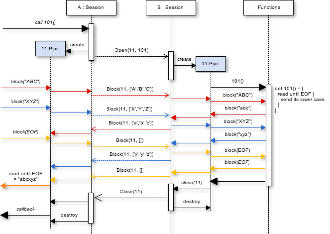
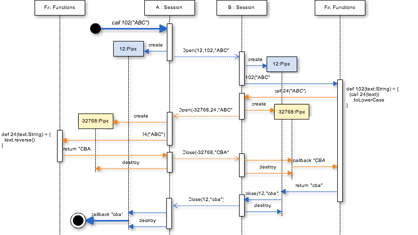

# Asterisk\* Protocol Design and Specification

## Introduction

**Asterisk** は非同期メッセージングをベースとした協調型 P2P 分散システム向けの軽量 RPC フレームワークです。

Asterisk の目的は小型センサーデバイスから企業の大型ホストコンピュータまで様々なノードを接続しリソースを共有することです。すべてのノードは他のノードにサービス (計算リソース) を提供すると同時に、別のノードが提供する様々なサービスを利用することで全体として協調動作する Peer to Peer 型の分散システムを構成します。

システムに参加するノードは Peer の関係でありクライアント/サーバという明確な位置付けはありません。一方で、一般的に利用されている RPC プロトコルの多くはサービス提供者と利用者の役割 (Server 及び Client) が固定的であることを前提に設計されています。この違いから現実的な分散システムへの単方向 RPC プロトコルの適用は無駄なリソース消費や構成上の制約を招くことになります。

RPC プロトコルが単方向の特性を持つ理由の一つは、TCP 接続の開始がサービス利用側 (クライアント) の要求によって行われるスキームからもたらされています。これは、ルーターやファイアウォールなどを経由する通信環境では通信開始の選択肢を持てるノードが限定されるため、必然的にその選択肢を持てるノードのみがクライアントとなりうることを想定しています。しかしサービス提供者と利用者は役割上の概念であり、接続方向の制約とは本来無関係です。Asterisk ではサービスの提供/利用は接続方向に依存しません。

また、実行中の処理数と同じ TCP セッションを消費する RPC プロトコルも多く存在します。大規模システムにおいてはしばしば負荷集中により少数ノードからの接続でも数千単位の TCP セッションを消費している状況に遭遇することもあります。富豪的なリソース消費を伴うシステムでは負荷耐性の低いデバイスが参加することが困難になります。
これも本来であればフレームワークの抽象化によって隠蔽しリソースを共有するべき不要な負荷と言えます。

単一もしくは少数の TCP/IP セッション上で多くの論理呼び出しを構成すること。

* **RPC**: 一般的な RPC の実装モデルである Request-Response 型を包含する。
* **双方向性**: 通信の両端点でリモート呼び出し可能な機能を提供し双方から利用可能な構成。
* **メッセージング**: 双方の処理の間でメッセージを使用したり、メッセージをデータをストリームとして送受信する。
* **省リソース**: 非同期 I/O と組み合わせ単一の I/O セッション上で複数の RPC 呼び出しを同時に実行する。
* **抽象性**: TCP, UDP, Unix Pipe や標準入出力など下層の I/O 実装に依存しない。

## Components

asterisque\* は下層の I/O レイヤーと上層のリモート呼び出し可能な機能とを接続します。
I/O レイヤーは通信のための実装を隠蔽しメッセージのシリアライズ/デシリアライズを行います。

### Session

**セッション** は抽象化された通信端点を表します。下層の I/O レイヤーとキューで接続し、通信相手から受信したメッセージでパイプの生成、破棄、転送などを行います。

セッションには通信相手側から呼び出し可能な機能として 16 ビット整数で識別される複数の Function をバインドすることができます。この操作はセッションの状態で動的に行うことが出来ます。

### Pipe

**パイプ** は同一セッション上の通信端点がメッセージの宛先を示すために使用する仮想的な接続です (スコープは 1 function call です)。パイプは非同期実行されている処理から結果を参照するための Future の役割があります。またパイプを介してリモート処理にストリームデータを渡したり処理からストリームデータを受け取ることができます。

パイプは通信端点の双方で共有する 16 ビットの識別子によって特定されます。相手側とのネゴシエーションなしに単独でユニークなパイプ識別子を決定できるようにパイプ識別子の最上位ビットの使用について取り決めが必要です。例えば単一の TCP/IP 接続を用いた通信では接続を開始した側 (クライアント側) が 0x0000 マスク、通信を受けた側 (サーバ側) が 0x8000 マスクをセッションの間で固定的に使用します。これは同一セッション上で片方の端点からオープンできるパイプは最大でも 0x7FFF 個であることも意味しています。また通信相手からの Open 命令に自分と同じマスクが使用されていた場合、パイプのユニークが保障できないためただちにそのセッションを終了しなければなりません。

### Message

**メッセージ** はノードが Asterisk\* で通信する時に使用する 3 種類のデータフレームです。

1. **Open** … 通信相手とのセッション上で特定の function を実行するための仮想的なパイプを生成する命令です。Open メッセージはこれから形成しようとしているパイプの識別子、呼び出そうとしている function 識別子、function に渡すパラメータで構成されています。
2. **Close** … セッション上でオープンされている特定のパイプがこれ以上使われなくなった事を示すために使用されます。Close メッセージは閉じようとしているパイプ識別子と function の実行結果またはエラー状況を知らせる文字列が付属します。Open に対して単純に Close で応答する手順は一般的な Request/Response で実現される RPC プロトコルのモデルと同じです。
3. **Block** … オープン中のパイプに対してデータブロックを送信または受信するために使用されます。Block は宛先となるパイプ識別子に加えてデータを持ちます。このメッセージはパイプ上で抽象化されたデータストリームを形成することを目的としています。パイプに対して双方向の通信チャネルとして利用できます。TCP/IP のパケットと同様に下層の通信レイヤーの実装によっては複数の Block に分割されたり一つの Block に統合される可能性がありますが順序性は保障されています (言い換えれば下層の I/O レイヤーはブロックの順序性を保障する必要があります)。長さが 0 の Block はストリームの終端 (EOF) を意味します。Open によって呼び出された function は、自分が起動されたパイプからこのストリームを利用することが出来ます。

## Message Sequences

### Asynchronous RPC
例としてセッション中の通信端点 A, B があり、B 側のセッションに大文字を小文字に変換する function 100 が実装されているものとします。この機能を A から利用する時のメッセージのシーケンスは以下のようになります。

A はセッション上で未使用のパイプ識別子 10 を新たな呼び出しのために割り当てメッセージ `Open(10, 100, "ABC")` を送信し直ちに処理を返します。B はセッション上に新しいパイプ 10 を作成し function 100 を実行しメッセージ `Close(10, "abc")` を送信してパイプ 10 を破棄します。A はこの Close を受信するとパイプ 10 を破棄し実行結果 `"abc"` をコールバックします。

このような Open-Close の単純なセットからで行われる処理は非同期型の RPC と同じです。

### Asynchronous Streaming RPC
次にストリームを利用して A, B 双方がデータを送受信する場合のメッセージの流れを示します。B で実装されている function 101 は起動するとコンテキストのパイプからブロックを受信し、そのデータを小文字化したブロックを送信します。

非同期性を示すためにシーケンスを重ねていますので矢印の色に注目してください。

Asynchronous RPC との違いは Open 〜 Close 間にパイプ指定で Block の送受信が行われる点です。上記の例では `Open(11, 101)` で function 101 へのパイプ 11 を生成し、A から B へ複数のブロックを _B からの応答を待たずに_ 送信します。

B は受信した "ABC", "XYZ" をそれぞれ小文字に変換したブロックを送信し、EOF を検知したところで EOF を送信し処理を終了します。
A 側で受信したブロックはキューイングされています。A は EOF 送信後キューにたまっているブロックをすべて読み込むことで期待する結果 "abcxyz" を得られます。

このようなストリームを使用する場合でも Open 時のパラメータや Close 時の結果を付加することが出来ます。

### Interactive RPC
最後に function の相互呼び出しについての例を挙げます。A 側のセッションに文字列を逆転させる function 24 が実装されており、B 側セッションに function 24 の呼び出した結果を小文字に変換する function 102 が実装されているものとします。

A 側から function 102 を呼び出したときのメッセージのシーケンスは以下のようになります。

このシーケンスはネストされた Asynchronous RPC です。このようなネストした呼び出しでもストリームを使用することが出来ます。

## Message Representation

TCP/IP のようなバイナリ通信のためのデータ表現実装は MessagePack を使用します。ただし、下層の I/O レイヤー実装によってはより効率的な選択を行うことが出来ます。

### Open Message

| Field    | MessagePack                   |                                  |
|:---------|:------------------------------|:---------------------------------|
| type     | positive fixnum               | 固定値 0x01                       |
| pipe     | int16                         | 割り当てるパイプの識別子             |
| function | int16                         | パイプをオープンする function 識別子 |
| params   | fixarray/array16/32\[ *any* \]| 配列形式での function 実行引数      |

Open は type フィールドが 0x01 で表されるメッセージです。ピアと pipe フィールドで識別されるパイプを構築し受信側で function フィールドの示す処理を起動します。

params フィールドは function の実行引数を配列型で格納します。

### Close Message

| Field   | MessagePack     |                                            |
|:--------|:----------------|:-------------------------------------------|
| type    | positive fixnum | 固定値 0x02                                 |
| pipe    | int16           | パイプの識別子                               |
| success | true/false      | 処理が成功した場合 true                       |
| result  | *any* or string | 成功時:functionの結果、エラー時:メッセージ文字列 |

Close は type フィールドが 0x02 で表されるメッセージです。pipe フィールドのパイプの処理を終了しリソースを解放しても良い事を表すために使用されます。Close 送信または受信後のパイプに対する操作は未定義です。

Close には成功か失敗のどちらか一つの結果を付加する事ができます。success フィールドが `true` の場合、result フィールドには function の実行結果が格納されます。success フィールドが `false` の場合、result フィールドには function 側でのエラー状況を示すメッセージが文字列型 (`fixstr`, `str8`, `str16`, `str32`) で格納されます。

### Block Message

| Field   | MessagePack     |                     |
|:--------|:----------------|:--------------------|
| type    | positive fixnum | 固定値 0x03          |
| pipe    | int16           | パイプの識別子        |
| payload | bin8/16/32      | バイナリデータブロック |

Block は type フィールドが 0x03 で表されるメッセージです。pipe フィールドの示すパイプに対して payload フィールドに格納されたストリームのデータブロックを転送します。

Block メッセージは中継者による分割または結合が可能です。従ってアプリケーションはブロックにデータ単位としての意味を持たせることは出来ません。

### Supported Data-Type

Open メッセージの params フィールド、Close メッセージの result フィールドで使用できるデータは以下の通りです。

| Data Type | MessagePack                |                   |
|:----------|:---------------------------|:------------------|
| null      | nil                        | null 値           |
| Boolean   | true, false                | ブール代数値        |
| Byte      | int8                       | 8ビット符号付き整数  |
| Short     | int16                      | 16ビット符号付き整数 |
| Int       | int32                      | 32ビット符号付き整数 |
| Long      | int64                      | 64ビット符号付き整数 |
| Float     | float32                    | 単精度浮動小数点    |
| Double    | float64                    | 倍精度浮動小数点    |
| Binary    | bin8, bin16, bin32         | バイナリ           |
| String    | fixstr, str8, str16, str32 | 文字列             |
| UUID      | fixext16(type=0x01)        | UUID              |
| List      | fixarray, array16, array32 | リスト (配列)      |
| Map       | fixmap, map16, map32       | マップ             |

List 及び Map は別のデータを内包できるコンテナ型です。List は順序性を維持した状態で任意数のデータを保持することが出来ます。Map はキーの一意性を維持した状態で値とのマッピングを保持します。キー及び値のデータは上記のいずれかを使用できます。

参考: [Serialization: Type to Format Conversion](https://github.com/msgpack/msgpack/blob/master/spec.md#serialization-type-to-format-conversion)

### Limitation

* リソースの限定されたデバイスでの使用を考慮して 1 メッセージにおけるバイナリ表現が 64kB を越えることは出来ません。Open, Close メッセージに付加するデータが大きくなるのであれば Block を用いたストリームで送受信する方法を検討する必要があります。
* 循環参照の存在する List または Map を使用することは出来ません。

## Misc
### セキュリティ
Asterisk* ではセキュリティについての定義は行いません。通信経路上の暗号化及び通信相手の認証は下層の I/O フレームワークでの SSL/TLS レイヤーで行うことを前提としています。あるいは上層のアプリケーションレイヤーで独自の認証機構を実装する必要があります。

### 負荷分散
TCP セッションごとにクラスタ化された複数のノードへ処理を分散させることが可能です。また function に冪等性があるならばメッセージのフレームを認識しパイプ識別子ごとに分散させることが可能です。